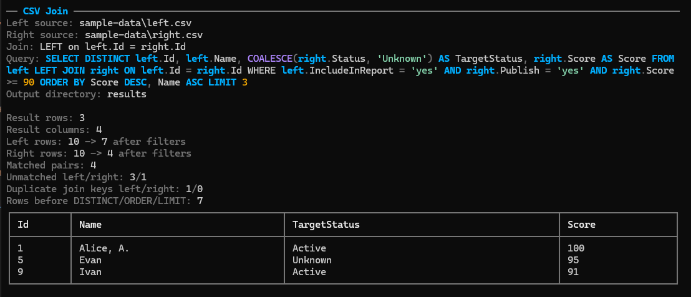

# CsvJoin


Console utility that reads two CSV files from `appsettings.json`, applies a SQL-like join from configuration, prints the result to the console, saves the full result to a CSV file, and can open that file after completion.



## Structure

The project follows the same high-level approach as `NReleaseBuilder`:

- `src/CsvJoin` - application project
- `Abstractions / Application / Configuration / Csv / Presentation / Models` - separated responsibilities
- `src/CsvJoin.Tests` - unit tests for parser, join engine, and configuration validation

## Configuration

Main configuration lives in [src/CsvJoin/appsettings.json](src/CsvJoin/appsettings.json).

Example:

```json
{
  "Sources": {
    "left": {
      "FilePath": "sample-data\\left.csv",
      "Delimiter": ",",
      "Encoding": "utf-8",
      "TrimFields": true,
      "NullValues": [ "", "N/A" ],
      "Quote": "\"",
      "IgnoreBlankLines": true
    },
    "right": {
      "FilePath": "sample-data\\right.csv",
      "Delimiter": ",",
      "Encoding": "utf-8",
      "TrimFields": true,
      "NullValues": [ "", "N/A" ],
      "Quote": "\"",
      "IgnoreBlankLines": true
    }
  },
  "Query": "SELECT DISTINCT left.Id, left.Name, COALESCE(right.Status, 'Unknown') AS TargetStatus FROM left LEFT JOIN right ON left.Id = right.Id WHERE left.Country IS NOT NULL AND right.Status IS NOT NULL ORDER BY TargetStatus ASC, Name ASC LIMIT 100",
  "JoinKeys": {
    "TrimWhitespace": true,
    "IgnoreCase": true
  },
  "Output": {
    "ResultsDirectory": "results",
    "Delimiter": ",",
    "ConsoleMaxRows": 50,
    "OpenResultAfterBuild": true
  }
}
```

## DSL

Supported query format:

```text
SELECT left.Id, COALESCE(right.[Full Name], 'Unknown') AS Name
FROM left INNER|LEFT|RIGHT|FULL JOIN right
ON left.Id = right.ExternalId
WHERE left.Country IS NOT NULL AND right.Status != 'Archived'
ORDER BY Name ASC
LIMIT 100
```

Supported features:

- `DISTINCT`
- `INNER`, `LEFT`, `RIGHT`, `FULL`
- field aliases via `AS`
- per-column fallback values via `COALESCE(alias.Field, 'default')`
- headers with spaces via brackets: `right.[Full Name]`
- wildcard selection: `left.*`, `right.*`
- source-row filtering before join via `WHERE alias.Field = 'value'`, `!=`, `<>`, `IS NULL`, `IS NOT NULL`, joined with `AND`
- sorting by output columns via `ORDER BY Column ASC|DESC`
- result limits via `LIMIT n` or `TOP n`

## Run

```powershell
dotnet run --project .\src\CsvJoin
```

## Output

- result is rendered to the console
- full CSV is written to `results\<file1>_<file2>_<timestamp>.csv`
- when `OpenResultAfterBuild` is `true`, the result file is opened via shell

## CSV input options

Each source can configure `Encoding`, `TrimFields`, `NullValues`, `Quote`, and `IgnoreBlankLines`.

`JoinKeys` controls matching only: `TrimWhitespace` removes leading/trailing spaces from join keys, and `IgnoreCase` makes key comparison case-insensitive.

## Tests

```powershell
dotnet test .\src\CsvJoin.slnx
```
